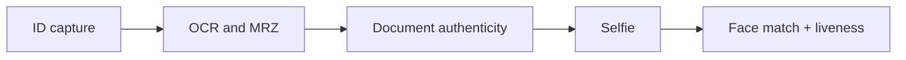
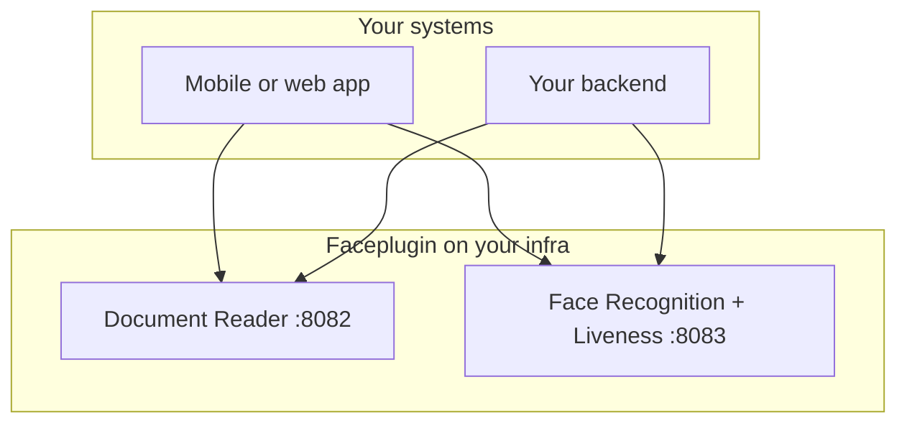

# Architecture

Faceplugin ships product SDKs you combine in **your** mobile app or backend.

Faceplugin does **not** ship one all-in-one identity-verification app.

## Recommended: combined Recognition + Liveness

For production eKYC, prefer **combined** packages instead of running recognition and liveness as two separate Face (or Document) services:

| Need | Prefer | Avoid (unless you must split) |
| --- | --- | --- |
| Face match + face PAD | [Face Recognition + Liveness](../face-recognition-sdk/recognition-and-liveness.md) on **8083** (`faceplugin/face-recognition-liveness-sdk`) | Face Recognition **8083** + Face Liveness **8084** as two containers |
| Document OCR + document authenticity | [Document Reader](../id-document-recognition-sdk/recognition-and-liveness.md) on **8082** with a Liveness-capable license | Document Reader **8082** + Document Liveness **8086** when you already need OCR |

Use standalone [Face Liveness](../liveness-detection-sdk/) (**8084**) or [ID Document Liveness](../id-document-liveness-sdk/) (**8086**) only when you want **anti-spoofing without** matching or OCR.

## Typical eKYC flow

**eKYC** means electronic know-your-customer / digital identity onboarding.



| Step | Recommended product |
| --- | --- |
| Read the ID + check it is real | [ID Document Recognition + Liveness](../id-document-recognition-sdk/recognition-and-liveness.md) (port **8082**) |
| Check the selfie is live and match to ID photo | [Face Recognition + Liveness](../face-recognition-sdk/recognition-and-liveness.md) (port **8083**) |

You own the final pass / fail decision. The SDKs return scores and fields. They do not decide your business outcome.

## Recommended topology

Run **one process or container per product**. For face and documents, that product should usually be the **combined** package.



Optional authenticity-only Document Liveness (**8086**) or Face Liveness (**8084**) only if you intentionally split services.

Do **not** copy two Google Drive runtimes into one `lib/cpu/` folder.

```text
lib/
  dcr/cpu/    # Document Reader
  far/cpu/    # Face Recognition (+ fal.fpk inside combined FaceRecognitionSDK)
```

| Product | Code | Pack example |
| --- | --- | --- |
| Face Recognition | `far` | `far.fpk` |
| Face Liveness | `fal` | `fal.fpk` (also inside combined FaceRecognitionSDK) |
| Document Reader / Document Liveness | `dcr` | `dcr.fpk` |

Never ship a generic `models.fpk` next to another product.


OpenCV, OpenSSL, and ONNX builds often differ between products. Shared libraries can overwrite each other. That can crash the process or return wrong scores.


## Who owns what

| You own | Faceplugin SDK owns |
| --- | --- |
| Template / person gallery database | Face detect, quality, template extract, 1:1 match |
| Document JSON storage and PII policy | OCR, MRZ, barcode, document authenticity scores |
| Orchestration and business decisions | Face liveness / PAD score |
| TLS, reverse proxy, network access | Engine processing inside your process or container |
| License request and key storage | Offline activate after you install the key |

A **template** is a face feature vector. Store it in **your** database. The server Face Recognition API has **no** `POST /api/identify` gallery.

## Two ways to integrate on a server

### Option A — HTTP sidecar

Run `app.py` or the Docker image. Call it from any language.

```text
Your backend  →  HTTP API  →  sdk.py  →  lib/cpu
```

Use this when several services need the engine, or when your backend is not Python.

### Option B — In-process Python

Import `sdk.py` on the **same** host as `lib/cpu/` (or inside the container).

```text
Your Python process  →  sdk.py  →  lib/cpu
```

Use this when you want fewer network hops and you already run Python next to the runtime.

**Gradio** (`demo` / `demo.py`) is a local UI for testing. Do not ship it in production. See [Production deployment](production-deployment.md).

## Mobile multi-SDK note

On mobile, keep each product’s AAR or frameworks separate. Request one license **per** application id **per** product. Call one engine at a time.

Face Liveness has no public Flutter or React Native SDK. Prefer Face Recognition + Liveness mobile apps (Identify includes 2D liveness), and/or a native Face Liveness module when you need PAD without matching.

### Related documentation

* [Hosting requirements](hosting-requirements.md) · [Production deployment](production-deployment.md) · [HTTP API](../http-api/) · [Choose a product](../resources/choose-a-product.md)
