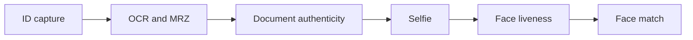
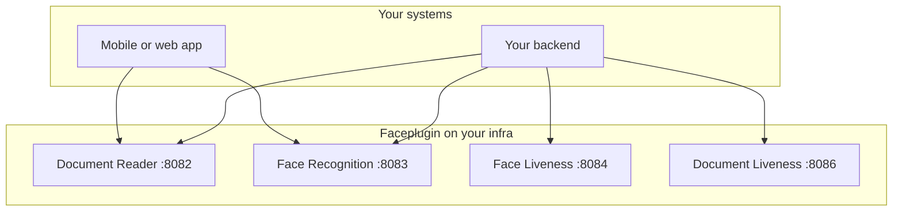

# Architecture

Faceplugin ships **separate** SDKs. You combine them in **your** mobile app or backend.

Faceplugin does **not** ship one all-in-one identity-verification app.

## Typical eKYC flow

**eKYC** means electronic know-your-customer / digital identity onboarding.

A common flow is:



| Step | Product |
| --- | --- |
| Read the ID | [ID Document Recognition](../id-document-recognition-sdk/) (port **8082**) |
| Check the ID is real | Document authenticity on **8082**, or [ID Document Liveness](../id-document-liveness-sdk/) on **8086** |
| Check the selfie is live | [Face Liveness](../liveness-detection-sdk/) (port **8084**), or `/api/liveness` on Face Recognition + Liveness (**8083**) |
| Match selfie to ID photo | [Face Recognition](../face-recognition-sdk/) (port **8083**) |

You own the final pass / fail decision. The SDKs return scores and fields. They do not decide your business outcome.

## Recommended topology

Run **one process or container per product**.



Do **not** copy two Google Drive runtimes into one `lib/cpu/` folder.

```text
lib/
  dcr/cpu/    # Document Reader
  far/cpu/    # Face Recognition
  fal/cpu/    # Face Liveness
```

| Product | Code | Pack example |
| --- | --- | --- |
| Face Recognition | `far` | `far.fpk` |
| Face Liveness | `fal` | `fal.fpk` |
| Document Reader / Document Liveness | `dcr` | `dcr.fpk` |

Never ship a generic `models.fpk` next to another product.


OpenCV, OpenSSL, and ONNX builds often differ between products. Shared libraries can overwrite each other. That can crash the process or return wrong scores.


## Who owns what

| You own | Faceplugin SDK owns |
| --- | --- |
| Template / person gallery database | Face detect, quality, template extract, 1:1 match |
| Document JSON storage and PII policy | OCR, MRZ, barcode, document authenticity scores |
| Orchestration and business decisions | Face liveness / PAD score |
| TLS, reverse proxy, network access | Engine processing inside your process or container |
| License request and key storage | Offline activate after you install the key |

A **template** is a face feature vector. Store it in **your** database. The server Face Recognition API has **no** `POST /api/identify` gallery.

## Two ways to integrate on a server

### Option A — HTTP sidecar

Run `app.py` or the Docker image. Call it from any language.

```text
Your backend  →  HTTP API  →  sdk.py  →  lib/cpu
```

Use this when several services need the engine, or when your backend is not Python.

### Option B — In-process Python

Import `sdk.py` on the **same** host as `lib/cpu/` (or inside the container).

```text
Your Python process  →  sdk.py  →  lib/cpu
```

Use this when you want fewer network hops and you already run Python next to the runtime.

**Gradio** (`demo` / `demo.py`) is a local UI for testing. Do not ship it in production. See [Production deployment](production-deployment.md).

## Mobile multi-SDK note

On mobile, keep each product’s AAR or frameworks separate. Request one license **per** application id **per** product. Call one engine at a time.

Face Liveness has no public Flutter or React Native SDK. Use Face Recognition’s 2D liveness on Identify, and/or a native Face Liveness module.

### Related documentation

* [Hosting requirements](hosting-requirements.md) · [Production deployment](production-deployment.md) · [HTTP API](../http-api/) · [Choose a product](../resources/choose-a-product.md)
