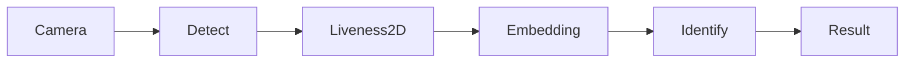

# Face Recognition SDK

### Overview

**Faceplugin Face Recognition SDK** is a fully **on-premise, offline** face matching engine. Images are processed on the device or on your server — not in Faceplugin’s cloud. The algorithm is evaluated on **NIST FRVT** (Face Recognition Vendor Test).

**What it can do:** See [Face Recognition capabilities](capabilities.md) — 1:1 match, mobile **1:N Identify** (match one face against many enrolled templates), Face Recognition API on port **8083**, and available liveness options.

This product focuses on **face recognition and identification**. It is different from the standalone [Face Liveness Detection SDK](../liveness-detection-sdk/), which is designed specifically for presentation attack detection (anti-spoofing). On mobile, **1:N Identify includes passive 2D liveness** as part of the identification workflow. If you need standalone face liveness detection, use the Face Liveness Detection SDK.

**Mobile:** You can enroll users, store their face templates in your own database, and perform live 1:N identification with VideoWorker.

**Windows/Linux:** The Face Recognition API uses HTTP requests with still images for face detection, quality checks, template extraction, matching, and similarity comparison. The standard server SDK does **not** provide a server-side 1:N identification endpoint. For 1:N identification on the server, store face templates in your own database and compare them using `/api/similarity`.

For server deployments that also require liveness detection, the combined [Recognition + Liveness](face-recognition-sdk-linux.md) package provides `POST /api/liveness` on port **8083**.

### Features

* [x] Face Detection
* [x] Face Landmark Detection
* [x] Face Template Extraction
* [x] Face Template Matching
* [x] Live 1:N Identify (mobile)
* [x] Liveness Detection (passive 2D on mobile Identify)
* [x] Pose Estimation
* [x] On-premise Face Recognition API (port **8083**)

### Platforms

Start with [Capabilities](capabilities.md), then **Mobile SDK** or **Server SDK**. Each platform page includes GitHub source, install steps, and the APIs that product actually exposes.

<table data-view="cards"><thead><tr><th></th><th></th><th></th><th data-hidden data-card-target data-type="content-ref"></th></tr></thead><tbody><tr><td></td><td><strong>Capabilities</strong></td><td>Offline matching, Identify, API 8083, liveness options.</td><td><a href="capabilities.md">capabilities.md</a></td></tr><tr><td></td><td><strong>Mobile SDK</strong></td><td>Android, iOS, Flutter, React Native, and Ionic.</td><td><a href="mobile-sdk.md">mobile-sdk.md</a></td></tr><tr><td></td><td><strong>Server SDK</strong></td><td>Windows, Linux / Docker, .NET, and open-source Python.</td><td><a href="server-sdk.md">server-sdk.md</a></td></tr><tr><td></td><td><strong>Open Source Windows &#x26; Linux</strong></td><td>Free Python sample — lower accuracy than the commercial HTTP API.</td><td><a href="open-source-windows-and-linux.md">open-source-windows-and-linux.md</a></td></tr><tr><td></td><td><strong>Open Source Web</strong></td><td>Browser JavaScript, React, and Vue samples.</td><td><a href="web-clients.md">web-clients.md</a></td></tr></tbody></table>

Typical call order on **mobile**: `setActivation` → `init` → detect / extract template → store templates in **your** database → `similarity` or VideoWorker (live 1:N). Identify default **0.67**. Liveness default **0.5**.

Typical call order on **Linux / Windows**: `GET /api/machinecode` → `POST /api/activate` → `POST /api/detect` / `match` / `similarity`. There is **no** server-side 1:N gallery (`POST /api/identify` does not exist).

### FAQ

**Can face recognition work completely offline?** Yes. After you activate with an `FP1.…` key, matching does not need the internet. See [Capabilities](capabilities.md).

**Does this SDK include liveness?** Mobile Identify includes passive 2D liveness. For standalone face anti-spoofing, use the [Face Liveness Detection SDK](../liveness-detection-sdk/). On the server you can use combined [Recognition + Liveness](face-recognition-sdk-linux.md), which provides both services on port **8083**.

**Is there a Face Recognition API?** Yes — Linux Docker and Windows HTTP on port **8083**. See [Linux](face-recognition-linux-sdk.md), [Windows](face-recognition-windows-sdk.md), and combined [Face Recognition + Liveness Linux](face-recognition-sdk-linux.md) / [Windows](face-recognition-sdk-windows.md).

**Does the server SDK support 1:N identification?** The server SDK does not provide a built-in 1:N gallery or `POST /api/identify` endpoint.

Instead, store face templates in your own database. When you need to identify a person, compare the probe template against your stored templates using `/api/similarity` and determine the best match in your application.

### Use cases

* **Access control** — enroll face templates, then live 1:N Identify at a door or gate (mobile)
* **Attendance** — enroll staff once; match camera frames against your person database
* **App login** — 1:1 selfie match against a stored template (`similarity` / `POST /api/match`)
* **KYC selfie match** — after ID OCR, compare portrait crop to a live selfie (with [Document Recognition](../id-document-recognition-sdk/) and optional [Face Liveness](../liveness-detection-sdk/))
* **Fraud checks** — still-image detect / match / similarity on your server (port **8083**)

### Related documentation

* [Capabilities](capabilities.md) · [Face Liveness Detection SDK](../liveness-detection-sdk/) · [ID Document Recognition SDK](../id-document-recognition-sdk/)
* [Request a License](../request-a-license-and-support.md) · [Try it](../resources/try-it.md) · [FAQ](../resources/faq.md) · [Glossary](../resources/glossary.md)
* [Combining products (eKYC)](../resources/choose-a-product.md) · [SDK comparison](../resources/comparisons/)
* [Status codes](../resources/status-codes.md)
