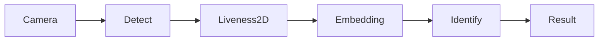

# Face Recognition SDK

### Overview

**Faceplugin Face Recognition SDK** is a fully **on-premise, offline** face matching engine. Images are processed on the device or on your server — not in Faceplugin’s cloud. The algorithm is evaluated on **NIST FRVT**.

**What it can do:** [Face Recognition capabilities](capabilities.md) — 1:1 match, mobile 1:N Identify, Face Recognition API on port **8083**, and how liveness fits.

This is **not** the standalone [Face Liveness Detection SDK](../liveness-detection-sdk/) (PAD only). It is **not** a passport OCR SDK — use [ID Document Recognition](../id-document-recognition-sdk/) to read IDs. On mobile, Identify already includes **passive 2D liveness**. For PAD without enrollment, use Face Liveness Detection.

On **mobile**, demos enroll people, run live **1:N Identify** (VideoWorker), and store templates in **your** database. On **Linux and Windows**, the Face Recognition **API** is still-image HTTP: detect, quality, feature, match, similarity. The combined [Recognition + Liveness](face-recognition-sdk-linux.md) Apps also expose `POST /api/liveness` on the same port **8083**. There is **no** `POST /api/identify` gallery.

### Features

* [x] Face Detection
* [x] Face Landmark Detection
* [x] Face Template Extraction
* [x] Face Template Matching
* [x] Live 1:N Identify (mobile)
* [x] Liveness Detection (passive 2D on mobile Identify)
* [x] Pose Estimation
* [x] Fully On-Premise Face Recognition API (port **8083**)

### Platforms

Start with [Capabilities](capabilities.md), then **Mobile SDK** or **Server SDK**. Each platform page includes GitHub source, install steps, and the APIs that App actually ships.

<table data-view="cards"><thead><tr><th></th><th></th><th></th><th data-hidden data-card-target data-type="content-ref"></th></tr></thead><tbody><tr><td></td><td><strong>Capabilities</strong></td><td>Offline matching, Identify, API 8083, liveness options.</td><td><a href="capabilities.md">capabilities.md</a></td></tr><tr><td></td><td><strong>Mobile SDK</strong></td><td>Android, iOS, Flutter, React Native, and Ionic.</td><td><a href="mobile-sdk.md">mobile-sdk.md</a></td></tr><tr><td></td><td><strong>Server SDK</strong></td><td>Windows, Linux / Docker, .NET, and open-source Python.</td><td><a href="server-sdk.md">server-sdk.md</a></td></tr><tr><td></td><td><strong>Open Source Web</strong></td><td>Browser JavaScript, React, and Vue samples.</td><td><a href="web-clients.md">web-clients.md</a></td></tr></tbody></table>

Typical call order on **mobile**: `setActivation` → `init` → detect / extract template → store templates in **your** database → `similarity` or VideoWorker (live 1:N). Identify default **0.67**. Liveness default **0.5**.

Typical call order on **Linux / Windows**: `GET /api/machinecode` → `POST /api/activate` → `POST /api/detect` / `match` / `similarity`. There is **no** server-side 1:N gallery (`POST /api/identify` does not exist).

### FAQ

**Can face recognition work completely offline?** Yes. After you activate with an `FP1.…` key, matching does not need the internet. See [Capabilities](capabilities.md).

**Does this SDK include liveness?** Mobile Identify includes passive 2D liveness. Standalone iBeta-class PAD is the [Face Liveness Detection SDK](../liveness-detection-sdk/). On the server you can use [Recognition + Liveness](face-recognition-sdk-linux.md) (one App on **8083** with `/api/liveness`), or recognition-only **8083** plus Face Liveness **8084** as two Apps.

**Is there a Face Recognition API?** Yes — Linux Docker and Windows HTTP on port **8083**. See [Linux](face-recognition-linux-sdk.md), [Windows](face-recognition-windows-sdk.md), and combined [+ Liveness Linux](face-recognition-sdk-linux.md) / [Windows](face-recognition-sdk-windows.md).

**Server-side 1:N?** No. Store templates in your database and call `/api/similarity`.

### Usecases

* [x] Access Control & Security
* [x] Attendance & Time Tracking
* [x] Law Enforcement & Public Safety
* [x] User Authentication for Applications
* [x] Retail & Customer Experience
* [x] Healthcare
* [x] Travel & Transportation
* [x] Smart Devices & IoT
* [x] Entertainment & Events
* [x] Education
* [x] Fraud Prevention

### Related documentation

* [Capabilities](capabilities.md) · [Face Liveness Detection SDK](../liveness-detection-sdk/) · [ID Document Recognition SDK](../id-document-recognition-sdk/)
* [Request a License](../request-a-license-and-support.md) · [Try it](../resources/try-it.md) · [FAQ](../resources/faq.md)
* [Combining products (eKYC)](../resources/choose-a-product.md) · [SDK comparison](../resources/comparisons/README.md)
* [Status codes](../resources/status-codes.md)
