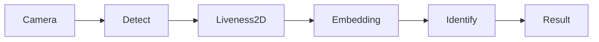

# Face SDK

### Overview

**Faceplugin Face SDK** covers **face recognition**, **standalone face liveness**, and **recognition + liveness** in one server process. Images are processed on the device or on your server — not in Faceplugin’s cloud. Recognition is evaluated on **NIST FRVT** (Face Recognition Vendor Test).

**What it can do:** [Capabilities](capabilities.md). Then pick a mode:

* **[Recognition](recognition.md)** — 1:1 match, mobile 1:N Identify, Face Recognition API on **8083**
* **[Liveness](../liveness-detection-sdk/README.md)** — passive anti-spoofing only on **8084** / mobile
* **[Recognition + Liveness](recognition-and-liveness.md)** — match and `POST /api/liveness` in one process on **8083**

```mermaid
flowchart LR
  Camera --> Detect
  Detect --> Liveness2D
  Liveness2D --> Embedding
  Embedding --> Identify
  Identify --> Result
```

### Features

* [x] Face Detection
* [x] Face Landmark Detection
* [x] Face Template Extraction
* [x] Face Template Matching
* [x] Live 1:N Identify (mobile)
* [x] Liveness Detection (passive 2D on mobile Identify)
* [x] Pose Estimation
* [x] On-premise Face Recognition API (port **8083**)

### Modes

Start with [Capabilities](capabilities.md), then open a mode.

<table data-view="cards"><thead><tr><th></th><th></th><th></th><th data-hidden data-card-target data-type="content-ref"></th></tr></thead><tbody><tr><td></td><td><strong>Capabilities</strong></td><td>Recognition, liveness, and recognition + liveness in one place.</td><td><a href="capabilities.md">capabilities.md</a></td></tr><tr><td></td><td><strong>Recognition</strong></td><td>Mobile Identify and server API on port 8083.</td><td><a href="recognition.md">recognition.md</a></td></tr><tr><td></td><td><strong>Liveness</strong></td><td>Standalone face anti-spoofing on mobile and port 8084.</td><td><a href="../liveness-detection-sdk/README.md">../liveness-detection-sdk/README.md</a></td></tr><tr><td></td><td><strong>Recognition + Liveness</strong></td><td>One server process with match and /api/liveness on 8083.</td><td><a href="recognition-and-liveness.md">recognition-and-liveness.md</a></td></tr></tbody></table>

Typical call order on **mobile**: `setActivation` → `init` → detect / extract template → store templates in **your** database → `similarity` or VideoWorker (live 1:N). Identify default **0.67**. Liveness default **0.5**.

Typical call order on **Linux / Windows**: `GET /api/machinecode` → `POST /api/activate` → `POST /api/detect` / `match` / `similarity`. There is **no** server-side 1:N gallery (`POST /api/identify` does not exist).

### FAQ

**Can face recognition work completely offline?** Yes. After you activate with a license key, matching does not need the internet. See [Capabilities](capabilities.md).

**Does this SDK include liveness?** Mobile Identify includes passive 2D liveness. For standalone face anti-spoofing, use the [Face Liveness Detection SDK](../liveness-detection-sdk/). On the server you can use combined [Recognition + Liveness](face-recognition-sdk-linux.md), which provides both services on port **8083**.

**Is there a Face Recognition API?** Yes — Linux Docker and Windows HTTP on port **8083**. See [Linux](face-recognition-linux-sdk.md), [Windows](face-recognition-windows-sdk.md), and combined [Face Recognition + Liveness Linux](face-recognition-sdk-linux.md) / [Windows](face-recognition-sdk-windows.md).

**Does the server SDK support 1:N identification?** The server SDK does not provide a built-in 1:N gallery or `POST /api/identify` endpoint.

Instead, store face templates in your own database. When you need to identify a person, compare the probe template against your stored templates using `/api/similarity` and determine the best match in your application.

### Use cases

* **Access control** — enroll face templates, then live 1:N Identify at a door or gate (mobile)
* **Attendance** — enroll staff once; match camera frames against your person database
* **App login** — 1:1 selfie match against a stored template (`similarity` / `POST /api/match`)
* **KYC selfie match** — after ID OCR, compare portrait crop to a live selfie (with [Document Recognition](../id-document-recognition-sdk/) and optional [Face Liveness](../liveness-detection-sdk/))
* **Fraud checks** — still-image detect / match / similarity on your server (port **8083**)

### Related documentation

* [Capabilities](capabilities.md) · [Recognition](recognition.md) · [Liveness](../liveness-detection-sdk/) · [Recognition + Liveness](recognition-and-liveness.md) · [ID Document SDK](../id-document-recognition-sdk/)
* [Request a License](../request-a-license-and-support.md) · [Try it](../resources/try-it.md) · [FAQ](../resources/faq.md) · [Glossary](../resources/glossary.md)
* [Combining products (eKYC)](../resources/choose-a-product.md) · [SDK comparison](../resources/comparisons/)
* [Status codes](../resources/status-codes.md)
