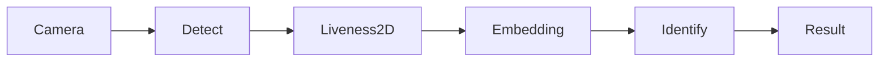

# Capabilities

What the Faceplugin **Face Recognition SDK** can do — matching, Identify, and the Face Recognition API — before you pick a platform.

For install: [Mobile SDK](mobile-sdk.md) or [Server SDK](server-sdk.md). For anti-spoofing without matching, see [Face Liveness capabilities](../liveness-detection-sdk/capabilities.md).

## Offline / on-premise face recognition

After you activate with an `FP1.…` key, face detection, template extraction, and matching run **offline** on the device or on **your** Windows/Linux host. Images are not sent to a Faceplugin cloud.

The algorithm is evaluated on **NIST FRVT** (as stated across Faceplugin Face Recognition docs).

## 1:1 match and mobile 1:N Identify

| Mode             | Where             | How                                                                                                 |
| ---------------- | ----------------- | --------------------------------------------------------------------------------------------------- |
| **1:1**          | Mobile and server | Extract two templates → `similarity` / `POST /api/similarity`, or `POST /api/match` with two images |
| **1:N Identify** | Mobile demos      | VideoWorker + templates you store in **your** database (demo default match threshold **0.67**)      |

On **Linux / Windows**, the HTTP API is still-image **detect / quality / feature / match / similarity**. There is **no** server-side `POST /api/identify` gallery — you store templates and call similarity yourself.

## Face templates you own

`templateExtraction` / `POST /api/feature` generates face templates that you can store in **your own database**. FacePlugin does not host your users' face data or provide a cloud-based person gallery.

## Passive 2D liveness on Identify

Mobile **1:N Identify** includes passive 2D liveness detection with a default threshold of **0.5**.

For standalone iBeta Level 2 certified face liveness detection, use the [Face Liveness Detection SDK](../liveness-detection-sdk/capabilities.md).

## Face Recognition API (Linux / Windows)

Default port **8083**:

| Route                  | Role          |
| ---------------------- | ------------- |
| `GET /api/machinecode` | `FPMC1.…`     |
| `POST /api/activate`   | Activate      |
| `POST /api/detect`     | Detect faces  |
| `POST /api/quality`    | Quality       |
| `POST /api/feature`    | Template      |
| `POST /api/match`      | Two images    |
| `POST /api/similarity` | Two templates |

Recognition-only images: `faceplugin/face-recognition`. Combined Recognition + Liveness (same port, adds `POST /api/liveness`): [Face Recognition + Liveness Linux](face-recognition-sdk-linux.md) / [Windows](face-recognition-sdk-windows.md).

## Platforms

| Surface                                    | Start here                        |
| ------------------------------------------ | --------------------------------- |
| Android, iOS, Flutter, React Native, Ionic | [Mobile SDK](mobile-sdk.md)       |
| Linux, Windows, .NET, open-source Python   | [Server SDK](server-sdk.md)       |
| Browser open-source samples                | [Open Source Web](web-clients.md) |

## Use cases

* Access control and security
* Attendance and time tracking
* User authentication in apps
* Fraud prevention and KYC selfie match (with [Document Recognition](../id-document-recognition-sdk/capabilities.md))

## FAQ

**Can face recognition work completely offline?** Yes, after license activation.

**Is there a Face Recognition API?** Yes — HTTP on port **8083**.

**Server-side 1:N gallery?** No. Store templates in your DB; call `/api/similarity`.

**Does it include liveness?** Mobile Identify includes 2D liveness. Standalone PAD is [Face Liveness](../liveness-detection-sdk/capabilities.md). Combined server App: [+ Liveness Linux](face-recognition-sdk-linux.md).

### Related documentation

* [Face Recognition SDK](./) · [Try it](../resources/try-it.md)
* [Face Liveness capabilities](../liveness-detection-sdk/capabilities.md)
* [ID Document capabilities](../id-document-recognition-sdk/capabilities.md)
* [Request a License](../request-a-license-and-support.md)
