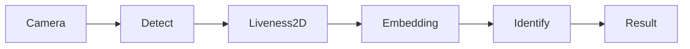

# Face SDK capabilities

What the Faceplugin **Face SDK** can do — **recognition**, **liveness**, and **recognition + liveness** — before you pick a platform.

| Mode | What you get | Start install |
| --- | --- | --- |
| **Recognition** | Detect, templates, 1:1 match, mobile 1:N Identify | [Recognition](recognition.md) |
| **Liveness** | Standalone passive face anti-spoofing (no gallery) | [Liveness](../liveness-detection-sdk/README.md) |
| **Recognition + Liveness** | Matching and `POST /api/liveness` in one server process | [Recognition + Liveness](recognition-and-liveness.md) |


```mermaid
flowchart LR
  Camera --> Detect
  Detect --> Liveness2D
  Liveness2D --> Embedding
  Embedding --> Identify
  Identify --> Result
```

## Recognition

After you activate with a license key, face detection, template extraction, and matching run **offline** on the device or on **your** Windows/Linux host. Images are not sent to a Faceplugin cloud.

The algorithm is evaluated on **NIST FRVT** (as stated across Faceplugin Face Recognition docs).

| Mode | Where | How |
| --- | --- | --- |
| **1:1** | Mobile and server | Extract two templates → `similarity` / `POST /api/similarity`, or `POST /api/match` with two images |
| **1:N Identify** | Mobile demos | VideoWorker + templates you store in **your** database (demo default match threshold **0.67**) |

On **Linux / Windows**, the HTTP API is still-image **detect / quality / feature / match / similarity**. There is **no** server-side `POST /api/identify` gallery — you store templates and call similarity yourself.

`templateExtraction` / `POST /api/feature` generates face templates that you can store in **your own database**. Faceplugin does not host your users' face data or provide a cloud-based person gallery.

Mobile **1:N Identify** includes passive 2D liveness (default threshold **0.5**) as part of the identify flow. That is **not** the same as the standalone Liveness product below.

### Recognition API (port 8083)

| Route | Role |
| --- | --- |
| `GET /api/machinecode` | Machine code |
| `POST /api/activate` | Activate |
| `POST /api/detect` | Detect faces |
| `POST /api/quality` | Quality |
| `POST /api/feature` | Template |
| `POST /api/match` | Two images |
| `POST /api/similarity` | Two templates |

Image: `faceplugin/face-recognition`. See [Linux](face-recognition-linux-sdk.md) · [Windows](face-recognition-windows-sdk.md).

## Liveness (standalone PAD)

Standalone **passive** presentation-attack detection: scores a camera frame or JPEG **without** a smile / turn-head challenge. These docs do **not** claim iBeta certification. Contact Faceplugin if you need a certification statement.

Detects attack types including:

* Printed photos
* Screen replays
* 3D models / masks
* Deepfake-style video (one type of spoof — not a separate deepfake product)

Score **≥ 0.5** → Real / pass (server default threshold in these docs).

| Surface | Behavior |
| --- | --- |
| **Android / iOS** | Live camera + VideoWorker / `faceDetection` for anti-spoofing |
| **Linux / Windows** | `POST /api/liveness` with one RGB JPEG on port **8084** |

There is **no** public Face Liveness Flutter or React Native SDK. Use native Liveness, or 2D liveness on Face Recognition Identify.

```bash
curl -s -X POST http://127.0.0.1:8084/api/liveness \
  -H 'Content-Type: application/json' \
  -d "{\"image\":\"$IMG\"}"
```

Images: `faceplugin/face-liveness`. See [Linux](../liveness-detection-sdk/liveness-detection-linux-sdk.md) · [Windows](../liveness-detection-sdk/liveness-detection-windows-sdk.md).

## Recognition + Liveness (one server process)

One container / process on port **8083**: all recognition routes **plus** `POST /api/liveness`. Image: `faceplugin/face-recognition-liveness-sdk`.

See [Linux](face-recognition-sdk-linux.md) · [Windows](face-recognition-sdk-windows.md).

## Which mode to pick

| Need | Mode |
| --- | --- |
| Enroll / 1:N match (mobile Identify includes 2D liveness) | **Recognition** |
| Anti-spoofing only (no gallery) | **Liveness** |
| Recognition + anti-spoofing in **one** server process | **Recognition + Liveness** |
| Document authenticity (ID spoof) | [ID Document SDK](../id-document-recognition-sdk/capabilities.md) |

## Platforms

| Mode | Surfaces |
| --- | --- |
| Recognition | [Server](server-sdk.md) (`faceplugin/face-recognition`) · [Open Source](open-source-windows-and-linux.md) |
| Liveness | [Mobile](../liveness-detection-sdk/mobile-sdk.md) · [Server](../liveness-detection-sdk/server-sdk.md) (**8084**) |
| Recognition + Liveness | [Mobile](mobile-sdk.md) · [Linux](face-recognition-sdk-linux.md) · [Windows](face-recognition-sdk-windows.md) · [.NET](face-recognition-dot-net-sdk.md) |

## Use cases

* **Access control / attendance** — enroll templates; live 1:N Identify
* **KYC selfies** — passive anti-spoofing before or with face match
* **Server fraud checks** — still-image detect / match / similarity on **8083**, or liveness on **8084** / combined **8083**

## FAQ

**Can face recognition work completely offline?** Yes, after license activation.

**Is there a Face Recognition API?** Yes — HTTP on port **8083**.

**Server-side 1:N gallery?** No. Store templates in your DB; call `/api/similarity`.

**Difference between Identify 2D liveness and Face Liveness?** Identify embeds 2D liveness in matching; standalone Liveness is anti-spoofing only (port **8084**).

### Related documentation

* [Face SDK](README.md) · [Try it](../resources/try-it.md) · [Glossary](../resources/glossary.md)
* [ID Document capabilities](../id-document-recognition-sdk/capabilities.md)
* [Request a License](../request-a-license-and-support.md)
