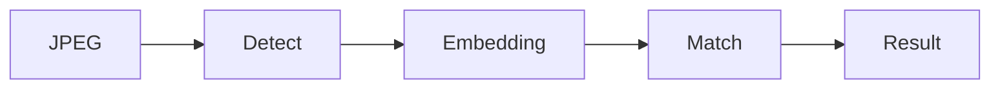

# Faceplugin Face Recognition Server SDK

Face Recognition as an HTTP API (or .NET bindings) on **your** machine. Still-image detect, quality, template extract, 1:1 match, and template similarity. Combined Recognition + Liveness packages also expose `POST /api/liveness` on the same port. There is **no** server-side 1:N gallery (`POST /api/identify` does not exist).

Typical call order: `GET /api/machinecode` → send `FPMC1.…` → `POST /api/activate` → `POST /api/detect` / `match` / `similarity` (and `/liveness` on the combined package). Default port **8083**.

Open-source Windows/Linux SDKs are free Python samples ([Open-Source-Face-Recognition-SDK](https://github.com/Faceplugin-ltd/Open-Source-Face-Recognition-SDK)) with lower accuracy than the commercial API.

For on-device apps, use [Mobile SDK](mobile-sdk.md).

<table data-view="cards"><thead><tr><th></th><th></th><th></th><th data-hidden data-card-cover data-type="files"></th><th data-hidden data-card-target data-type="content-ref"></th></tr></thead><tbody><tr><td></td><td><strong>Linux SDK</strong></td><td>Docker Hub image faceplugin/face-recognition. Same HTTP API as Windows.</td><td><a href="../.gitbook/assets/linux-docker.png">linux-docker.png</a></td><td><a href="face-recognition-linux-sdk.md">face-recognition-linux-sdk.md</a></td></tr><tr><td></td><td><strong>Windows SDK</strong></td><td>Commercial HTTP API on port 8083. CPU only. No Docker.</td><td><a href="../.gitbook/assets/windows.png">windows.png</a></td><td><a href="face-recognition-windows-sdk.md">face-recognition-windows-sdk.md</a></td></tr><tr><td></td><td><strong>+ Liveness Linux</strong></td><td>Docker image faceplugin/face-recognition-liveness-sdk. Recognition + anti-spoofing on 8083.</td><td><a href="../.gitbook/assets/linux-docker.png">linux-docker.png</a></td><td><a href="face-recognition-sdk-linux.md">face-recognition-sdk-linux.md</a></td></tr><tr><td></td><td><strong>+ Liveness Windows</strong></td><td>One Windows process with detect, match, and /api/liveness.</td><td><a href="../.gitbook/assets/windows.png">windows.png</a></td><td><a href="face-recognition-sdk-windows.md">face-recognition-sdk-windows.md</a></td></tr><tr><td></td><td><strong>Dot Net SDK</strong></td><td>.NET MAUI and C# bindings. Follow the public GitHub README.</td><td><a href="../.gitbook/assets/dotnet.png">dotnet.png</a></td><td><a href="face-recognition-dot-net-sdk.md">face-recognition-dot-net-sdk.md</a></td></tr><tr><td></td><td><strong>Open Source Linux</strong></td><td>Free Python SDK for Linux.</td><td><a href="../.gitbook/assets/python.png">python.png</a></td><td><a href="open-source-face-recognition-linux-sdk.md">open-source-face-recognition-linux-sdk.md</a></td></tr><tr><td></td><td><strong>Open Source Windows</strong></td><td>Free Python SDK. Lower accuracy than the commercial engine.</td><td><a href="../.gitbook/assets/python.png">python.png</a></td><td><a href="open-source-face-recognition-windows-sdk.md">open-source-face-recognition-windows-sdk.md</a></td></tr></tbody></table>

### FAQ

**Is this a Face Recognition API?** Yes. HTTP on port **8083**: `POST /api/detect`, `/api/match`, `/api/similarity`.

**Is there server-side 1:N?** No. There is no `POST /api/identify` gallery. Store templates in **your** database.

**Docker vs Windows?** Same routes. Windows has no Docker; Linux uses `faceplugin/face-recognition` (recognition) or `faceplugin/face-recognition-liveness-sdk` (combined).

**Recognition + liveness in one process?** Yes — [+ Liveness Linux](face-recognition-sdk-linux.md) / [Windows](face-recognition-sdk-windows.md). Or keep Face Liveness on **8084** as a separate product.

### Related documentation

* [Capabilities](capabilities.md) · [Faceplugin Face Recognition Mobile SDK](mobile-sdk.md) · [Face Recognition SDK](README.md)
* [Face Liveness Detection Server SDK](../liveness-detection-sdk/server-sdk.md)
* [ID Document Recognition Server SDK](../id-document-recognition-sdk/server-sdk.md)
* [Request a License](../request-a-license-and-support.md) · [Status codes](../resources/status-codes.md)
* [Combining products (eKYC)](../resources/choose-a-product.md) · [SDK comparison](../resources/comparisons/README.md)
