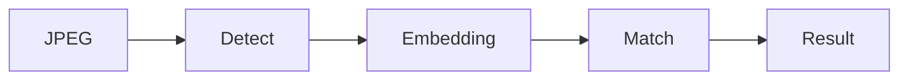

# Faceplugin Face Recognition Server SDK

Face **Recognition** as an HTTP API (or .NET bindings) on **your** machine. Still-image detect, quality, template extract, 1:1 match, and template similarity. There is **no** server-side 1:N gallery (`POST /api/identify` does not exist).

Typical call order: `GET /api/machinecode` → send machine code → `POST /api/activate` → `POST /api/detect` / `match` / `similarity`. Default port **8083**.

For recognition **and** liveness in one process, see [Recognition + Liveness](recognition-and-liveness.md). For on-device apps, use [Mobile SDK](mobile-sdk.md). Open-source Python samples: [Open Source](open-source-windows-and-linux.md).

<table data-view="cards"><thead><tr><th></th><th></th><th></th><th data-hidden data-card-cover data-type="files"></th><th data-hidden data-card-target data-type="content-ref"></th></tr></thead><tbody><tr><td></td><td><strong>Linux SDK</strong></td><td>Docker Hub image faceplugin/face-recognition. Same HTTP API as Windows.</td><td><a href="../.gitbook/assets/linux-docker.png">linux-docker.png</a></td><td><a href="face-recognition-linux-sdk.md">face-recognition-linux-sdk.md</a></td></tr><tr><td></td><td><strong>Windows SDK</strong></td><td>Commercial HTTP API on port 8083. CPU only. No Docker.</td><td><a href="../.gitbook/assets/windows.png">windows.png</a></td><td><a href="face-recognition-windows-sdk.md">face-recognition-windows-sdk.md</a></td></tr><tr><td></td><td><strong>.NET SDK</strong></td><td>.NET MAUI and C# bindings. Follow the public GitHub README.</td><td><a href="../.gitbook/assets/dotnet.png">dotnet.png</a></td><td><a href="face-recognition-dot-net-sdk.md">face-recognition-dot-net-sdk.md</a></td></tr></tbody></table>

```mermaid
flowchart LR
  JPEG --> Detect
  Detect --> Embedding
  Embedding --> Match
  Match --> Result
```

### FAQ

**Is this a Face Recognition API?** Yes. HTTP on port **8083**: `POST /api/detect`, `/api/match`, `/api/similarity`.

**Is there server-side 1:N?** No. There is no `POST /api/identify` gallery. Store templates in **your** database.

**Docker vs Windows?** Same routes. Windows has no Docker; Linux uses `faceplugin/face-recognition`.

**Recognition + liveness in one process?** See [Recognition + Liveness](recognition-and-liveness.md). Or keep Face Liveness on **8084** as a separate product.

### Related documentation

* [Capabilities](capabilities.md) · [Faceplugin Face Recognition Mobile SDK](mobile-sdk.md) · [Face Recognition SDK](README.md) · [Glossary](../resources/glossary.md)
* [Face Liveness Detection Server SDK](../liveness-detection-sdk/server-sdk.md)
* [ID Document Recognition Server SDK](../id-document-recognition-sdk/server-sdk.md)
* [Request a License](../request-a-license-and-support.md) · [Status codes](../resources/status-codes.md)
* [Combining products (eKYC)](../resources/choose-a-product.md) · [SDK comparison](../resources/comparisons/README.md)
