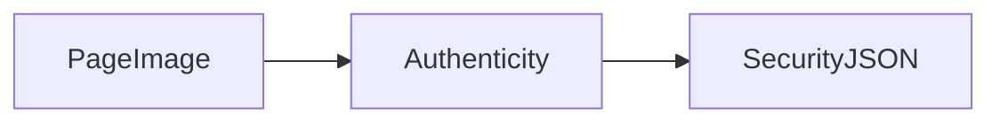

# ID Document Liveness SDK

### Overview

**Faceplugin ID Document Liveness SDK** checks whether the image is a **physical ID** or an attack: a screen replay, a printout, a digitally created page, or a substituted portrait.

This product does **not** read fields. OCR, MRZ (machine-readable zone), and barcodes are turned off. For **passport OCR plus authenticity** in one engine, use [ID Document Recognition](../id-document-recognition-sdk/) with a Liveness-capable license. This is **not** face anti-spoofing — use [Face Liveness Detection](../liveness-detection-sdk/) for selfies.

Today the public **SDK** is **Linux / Docker** (HTTP port **8086**). There is no public mobile SDK.

### Features

* [x] Document authenticity and liveness checks
* [x] Screen replay and digital-source detection
* [x] Printed copy checks
* [x] Front and back (multi-page) images
* [x] Fully On-Premise

### Platforms

<table data-view="cards"><thead><tr><th></th><th></th><th></th><th data-hidden data-card-target data-type="content-ref"></th></tr></thead><tbody><tr><td></td><td><strong>Server SDK</strong></td><td>Linux / Docker authenticity-only HTTP API on port 8086.</td><td><a href="server-sdk.md">server-sdk.md</a></td></tr></tbody></table>

### FAQ

**Does this read the MRZ?** No. Use ID Document Recognition for OCR / MRZ.

**How do I call it?** `POST /api/documentLiveness` after `POST /api/activate`. See [Linux SDK](id-document-liveness-linux-sdk.md).

### Use cases

* [x] Identity Verification & KYC (Know Your Customer)
* [x] Digital onboarding
* [x] Financial Services (Banking & Fintech)
* [x] Fraud Prevention

### Related documentation

* [ID Document Recognition SDK](../id-document-recognition-sdk/) · [Face Liveness Detection SDK](../liveness-detection-sdk/)
* [Document security check fields](../id-document-recognition-sdk/document-security-check-fields.md)
* [Request a License](../request-a-license-and-support.md) · [Try it](../resources/try-it.md)
* [Combining products (eKYC)](../resources/choose-a-product.md) · [SDK comparison](../resources/comparisons/README.md)
