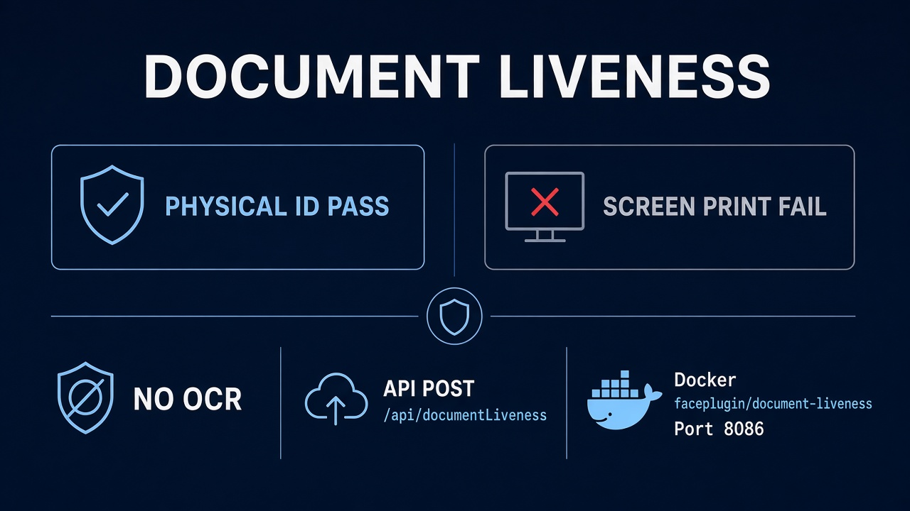
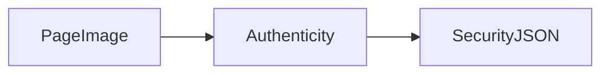

# Faceplugin ID Document Liveness Server SDK

<figure><figcaption>
No public mobile App for this product in Faceplugin-ltd GitHub.
</figcaption></figure>

Document authenticity only (screen replay, print, substitution). Optical character recognition (OCR), MRZ, and barcodes are **off**.

Typical call order: `GET /api/machinecode` → send `FPMC1.…` → `POST /api/activate` → `POST /api/documentLiveness`. Default port **8086**.

For **fields plus authenticity** in one engine, use [ID Document Recognition Server SDK](../id-document-recognition-sdk/server-sdk.md) with a Liveness-capable license.

There is no public mobile App for this product.

<table data-view="cards"><thead><tr><th></th><th></th><th></th><th data-hidden data-card-cover data-type="files"></th><th data-hidden data-card-target data-type="content-ref"></th></tr></thead><tbody><tr><td></td><td><strong>Linux SDK</strong></td><td>Docker image faceplugin/document-liveness. HTTP API on port 8086.</td><td><a href="../.gitbook/assets/linux-docker.png">linux-docker.png</a></td><td><a href="id-document-liveness-linux-sdk.md">id-document-liveness-linux-sdk.md</a></td></tr></tbody></table>

### FAQ

**Does this read the MRZ?** No. OCR is off. Use [ID Document Recognition](../id-document-recognition-sdk/).

**API?** `POST /api/documentLiveness` on port **8086** after `POST /api/activate`.

### Related documentation

* [ID Document Liveness SDK](README.md) · [Linux SDK](id-document-liveness-linux-sdk.md)
* [ID Document Recognition Server SDK](../id-document-recognition-sdk/server-sdk.md)
* [Request a License](../request-a-license-and-support.md) · [Status codes](../resources/status-codes.md)
* [Combining products (eKYC)](../resources/choose-a-product.md) · [SDK comparison](../resources/comparisons/README.md)
