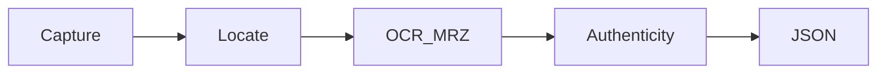

# ID Document Recognition SDK

### Overview

**Faceplugin ID Document Recognition SDK** is an on-premise **passport OCR** and **ID card verification** engine. It classifies the document, runs OCR, reads the MRZ, decodes barcodes and QR codes, checks image quality, and crops the portrait and signature.

This is **not** the authenticity-only [ID Document Liveness SDK](../id-document-liveness-sdk/). With a **Liveness-capable license**, the same document engine can also run **document authenticity** (document liveness). It is **not** a face matching SDK — use [Face Recognition](../face-recognition-sdk/) after you have a selfie.

All processing stays on the device or in your own server — **NO** data leaves your machine.

### Features

* [x] ID card, passport, and driver license recognition
* [x] MRZ, barcode, QR, and OCR
* [x] Document detection and type classification
* [x] Live camera locate overlay on mobile
* [x] Image quality analysis
* [x] Face, portrait, and signature extraction
* [x] Authenticity / document liveness (when licensed)
* [x] Fully On-Premise

### Passport OCR, ID card verification, MRZ

| Capability | Where it runs |
| --- | --- |
| Passport OCR / MRZ | `recognize` / `documentRecognition` / `documentProcess` on every platform |
| ID card and driver license OCR | Same APIs |
| Barcode / QR | Same APIs |
| Document verification API (HTTP) | Linux / Windows port **8082** |
| Authenticity without OCR | Dedicated [ID Document Liveness](../id-document-liveness-sdk/) on Linux **8086**, or `documentLiveness` on this engine when licensed |

Every platform returns the same field set: [Document result JSON](document-result-json.md). Authenticity names: [Document security check fields](document-security-check-fields.md).

### Platforms

Pick **Mobile SDK** or **Server SDK**, then the platform page.

<table data-view="cards"><thead><tr><th></th><th></th><th></th><th data-hidden data-card-target data-type="content-ref"></th></tr></thead><tbody><tr><td></td><td><strong>Mobile SDK</strong></td><td>Android, iOS, Flutter, React Native, and Ionic.</td><td><a href="mobile-sdk.md">mobile-sdk.md</a></td></tr><tr><td></td><td><strong>Server SDK</strong></td><td>Windows, Linux / Docker, and Node HTTP API on port 8082.</td><td><a href="server-sdk.md">server-sdk.md</a></td></tr><tr><td></td><td><strong>Web clients</strong></td><td>JavaScript, React, Vue, Angular demos calling the HTTP API.</td><td><a href="web-clients.md">web-clients.md</a></td></tr></tbody></table>

### FAQ

**Does Faceplugin read passports?** Yes — OCR, MRZ, and crops. See the platform pages and [Document result JSON](document-result-json.md).

**Is document liveness included?** Only with a Liveness-capable license on this engine, or via the dedicated Document Liveness Linux product.

**Is there a document verification API?** Yes — `POST /api/documentRecognition` and `POST /api/documentProcess` on port **8082**.

### Usecases

* [x] Identity Verification & KYC (Know Your Customer)
* [x] Digital onboarding
* [x] Financial Services (Banking & Fintech)
* [x] Government e-services
* [x] Access Control & Security
* [x] Fraud Prevention

### Related documentation

* [ID Document Liveness SDK](../id-document-liveness-sdk/) · [Face Recognition SDK](../face-recognition-sdk/)
* [Request a License](../request-a-license-and-support.md) · [Try it](../resources/try-it.md) · [FAQ](../resources/faq.md)
* [Combining products (eKYC)](../resources/choose-a-product.md) · [SDK comparison](../resources/comparisons/README.md)
* [Status codes](../resources/status-codes.md)
