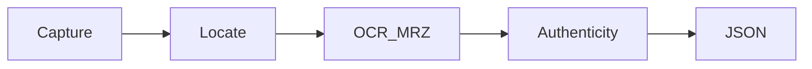

# ID Document SDK

### Overview

**Faceplugin ID Document SDK** covers **document recognition** (OCR / MRZ / barcode), **authenticity-only liveness**, and **recognition + liveness** in one Document Reader engine.

**Coverage:** **16,900** document templates across **255** countries and territories. Full list: [Supported documents PDF](capabilities.md#document-type-classification--worldwide-coverage). What the product can do: [Capabilities](capabilities.md).

* **[Recognition](recognition.md)** — OCR / MRZ overview (install via Document Reader platforms)
* **[Liveness](../id-document-liveness-sdk/README.md)** — authenticity only, no OCR (port **8086**)
* **[Recognition + Liveness](recognition-and-liveness.md)** — Document Reader mobile + server (**recommended** for eKYC)

It is **not** a face matching SDK — use the [Face SDK](../face-recognition-sdk/) after you have a selfie.

```mermaid
flowchart LR
  Capture --> Locate
  Locate --> OCR_MRZ
  OCR_MRZ --> Authenticity
  Authenticity --> JSON
```

All processing stays on the device or in your own server — **NO** data leaves your machine.

### Features

* [x] ID card, passport, and driver license recognition
* [x] MRZ, barcode, QR, and OCR
* [x] Document detection and type classification (**16,900** templates)
* [x] Live camera locate overlay on mobile
* [x] Image quality analysis
* [x] Face, portrait, and signature extraction
* [x] Authenticity / document liveness (when licensed)
* [x] On-premise document verification API (port **8082**)

### Passport OCR, ID card verification, MRZ

| Capability | Where it runs |
| --- | --- |
| Passport OCR / MRZ | `recognize` / `documentRecognition` / `documentProcess` on every platform |
| ID card and driver license OCR | Same APIs |
| Barcode / QR | Same APIs |
| Document verification API (HTTP) | Linux / Windows port **8082** |
| Authenticity without OCR | Dedicated [ID Document Liveness](../id-document-liveness-sdk/) on Linux **8086**, or `documentLiveness` on this engine when licensed |

Every platform returns the same field set: [Document result JSON](document-result-json.md). Authenticity names: [Document security check fields](document-security-check-fields.md). Deep dive: [Capabilities](capabilities.md).

### Supported documents

The engine classifies **passports, national IDs, driver licenses, visas, residence permits**, and many specialized credentials worldwide. Download the customer catalog:


Faceplugin Supported Documents (PDF)


Coverage: **16,900** templates across **255** countries and territories — full list in the PDF. Confirm a specific series with [support](../request-a-license-and-support.md) if needed.

### Modes

Pick **Capabilities**, then a mode.

<table data-view="cards"><thead><tr><th></th><th></th><th></th><th data-hidden data-card-target data-type="content-ref"></th></tr></thead><tbody><tr><td></td><td><strong>Capabilities</strong></td><td>Recognition, authenticity-only liveness, and OCR + authenticity.</td><td><a href="capabilities.md">capabilities.md</a></td></tr><tr><td></td><td><strong>Recognition</strong></td><td>OCR / MRZ overview — platforms under Recognition + Liveness.</td><td><a href="recognition.md">recognition.md</a></td></tr><tr><td></td><td><strong>Liveness</strong></td><td>Authenticity-only Linux API on port 8086.</td><td><a href="../id-document-liveness-sdk/README.md">../id-document-liveness-sdk/README.md</a></td></tr><tr><td></td><td><strong>Recognition + Liveness</strong></td><td>Document Reader mobile + server — recommended for eKYC.</td><td><a href="recognition-and-liveness.md">recognition-and-liveness.md</a></td></tr></tbody></table>

### FAQ

**Does Faceplugin read passports?** Yes — on-premise passport OCR, MRZ, and crops. See [Capabilities](capabilities.md) and [Document result JSON](document-result-json.md).

**Is this an ID card verification API?** Yes — `POST /api/documentRecognition` and `POST /api/documentProcess` on port **8082**, or on-device APIs on mobile.

**Does it read the MRZ?** Yes, when the document template includes an MRZ.

**Is document liveness included?** Only with a Liveness-capable license on this engine, or via the dedicated Document Liveness Linux product.

**How many document types?** **16,900** templates in **255** countries — [PDF catalog](capabilities.md#document-type-classification--worldwide-coverage).

### Use cases

* **Passport / ID onboarding** — classify the document, run OCR / MRZ / barcode (`recognize` / `documentRecognition`)
* **Digital KYC** — extract fields and portrait crops for downstream face match
* **Banking & fintech** — verify IDs on-device or via HTTP on port **8082**
* **Government e-services** — read national IDs and licenses from **16,900** templates
* **Fraud prevention** — optional document authenticity when your license includes it (or use [Document Liveness](../id-document-liveness-sdk/))

### Related documentation

* [Capabilities](capabilities.md) · [Recognition](recognition.md) · [Liveness](../id-document-liveness-sdk/) · [Recognition + Liveness](recognition-and-liveness.md) · [Face SDK](../face-recognition-sdk/)
* [Request a License](../request-a-license-and-support.md) · [Try it](../resources/try-it.md) · [FAQ](../resources/faq.md) · [Glossary](../resources/glossary.md)
* [Passport OCR & ID verification](../resources/passport-ocr-and-id-verification.md) · [Combining products (eKYC)](../resources/choose-a-product.md)
* [SDK comparison](../resources/comparisons/README.md) · [Status codes](../resources/status-codes.md)
