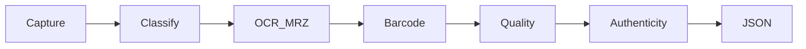
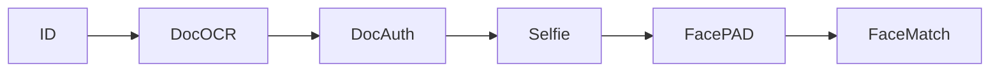

# ID Document Recognition capabilities

What the Faceplugin **ID Document Recognition SDK** (Document Reader) can do — before you pick Android, iOS, Flutter, or Linux.

Use this page to decide if the product fits your KYC / onboarding flow. For install steps, open [Mobile SDK](mobile-sdk.md) or [Server SDK](server-sdk.md). For a quick HTTP try, see [Try it](../resources/try-it.md).

All processing stays on the device or on **your** server. Document images are not sent to a Faceplugin cloud.

## Passport OCR and MRZ reading

Faceplugin reads **passports** (including ePassport data pages) with visual-zone OCR and ICAO-style **MRZ** parsing (TD1 / TD2 / TD3 style zones where the template supports them).

Typical outputs include document number, names, dates, nationality, and check digits — returned in the same JSON shape on every platform. See [Document result JSON](document-result-json.md).

**APIs:** mobile `recognize` / `documentProcess`; server `POST /api/documentRecognition` and `POST /api/documentProcess` on port **8082**.

## National ID and driver license verification

The same engine classifies and reads **national ID cards**, **driver licenses**, and related credentials. You do not pre-select country or series for typical stills — the SDK identifies the document type, then runs OCR / MRZ / barcode as the template allows.

## Barcode and QR parsing

Where the document template defines them, Faceplugin decodes **1D/2D barcodes** and **QR** codes and maps payload fields into the result JSON (for example PDF417 on many North American licenses).

## Document type classification — worldwide coverage

Faceplugin classifies **16,900** document templates across **255** countries and territories: passports, IDs, licenses, visas, residence permits, and specialized cards.


Faceplugin Supported Documents (PDF) — full catalog


Confirm an uncommon series with [support](../request-a-license-and-support.md) if needed.

## Image quality, crop, and portrait extraction

The engine can assess capture quality, locate the document, and return **cropped** document images plus **portrait** (and signature when present) for downstream face match or archival storage in **your** database.

## Document authenticity / document liveness

With a **Liveness-capable license**, the Document Reader engine can run **document authenticity** checks (document liveness) alongside OCR. Field names: [Document security check fields](document-security-check-fields.md).

If you need authenticity **without** OCR/MRZ, use the dedicated [ID Document Liveness SDK](../id-document-liveness-sdk/) on Linux (**8086**).

## On-premise document verification API

Linux Docker and Windows expose an HTTP **document verification API** on port **8082**:

| Route | Role |
| --- | --- |
| `GET /api/machinecode` | Machine code `FPMC1.…` |
| `POST /api/activate` | Activate license |
| `POST /api/documentRecognition` | OCR / MRZ / barcode |
| `POST /api/documentLiveness` | Authenticity (when licensed) |
| `POST /api/documentProcess` | Combined pipeline |

Images: [Linux](id-document-recognition-linux-sdk.md) `faceplugin/document-reader`, [Windows](id-document-recognition-windows-sdk.md). Node/Go/C++ HTTP options: [Server SDK](server-sdk.md).

## eKYC: document then face

A common onboarding flow:

1. Capture ID → Document Recognition (**8082** or mobile).
2. Optional document authenticity (same engine or Document Liveness **8086**).
3. Capture selfie → [Face Liveness](../liveness-detection-sdk/capabilities.md) (**8084**) and/or [Face Recognition](../face-recognition-sdk/capabilities.md) (**8083** / mobile).
4. Compare portrait crop to selfie with Face Recognition.

Orchestration stays in **your** app. See [Combining products](../resources/choose-a-product.md#combining-products-ekyc).

## Platforms

| Surface | Start here |
| --- | --- |
| Android, iOS, Flutter, React Native, Ionic | [Mobile SDK](mobile-sdk.md) |
| Linux Docker, Windows, Node | [Server SDK](server-sdk.md) |
| Browser demos (HTTP clients) | [Web clients](web-clients.md) |

## FAQ

**Is this a passport OCR SDK?** Yes — on-premise passport OCR and MRZ, plus ID cards and licenses.

**Is there an ID card verification API?** Yes — HTTP on port **8082**, or on-device APIs on mobile.

**Does Faceplugin read the MRZ?** Yes, when the document template includes an MRZ.

**How many document types are supported?** **16,900** templates in **255** countries and territories — see the PDF above.

### Related documentation

* [ID Document Recognition SDK](README.md) · [Try it](../resources/try-it.md)
* [Document result JSON](document-result-json.md) · [Request a License](../request-a-license-and-support.md)
* [Face Recognition capabilities](../face-recognition-sdk/capabilities.md) · [Face Liveness capabilities](../liveness-detection-sdk/capabilities.md)
