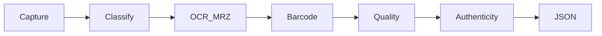

# ID Document SDK capabilities

What the Faceplugin **ID Document SDK** can do — **recognition**, **liveness** (authenticity-only), and **recognition + liveness** — before you pick a platform.

| Mode | What you get | Start install |
| --- | --- | --- |
| **Recognition** | OCR, MRZ, barcode, classify, crops (port **8082** / mobile) | [Recognition](recognition.md) |
| **Liveness** | Authenticity only — no OCR (port **8086**) | [Liveness](../id-document-liveness-sdk/README.md) |
| **Recognition + Liveness** | OCR plus document authenticity in one Document Reader engine | [Recognition + Liveness](recognition-and-liveness.md) |

```mermaid
flowchart LR
  Capture --> Classify
  Classify --> OCR_MRZ
  OCR_MRZ --> Barcode
  Barcode --> Quality
  Quality --> Authenticity
  Authenticity --> JSON
```

All processing stays on the device or on **your** server. Document images are not sent to a Faceplugin cloud.

## Recognition

### Passport OCR and MRZ reading

Faceplugin reads **passports** (including ePassport data pages) with visual-zone OCR and ICAO-style **MRZ** parsing (TD1 / TD2 / TD3 style zones where the template supports them).

Typical outputs include document number, names, dates, nationality, and check digits — returned in the same JSON shape on every platform. See [Document result JSON](document-result-json.md).

**APIs:** mobile `recognize` / `documentProcess`; server `POST /api/documentRecognition` and `POST /api/documentProcess` on port **8082**.

### National ID and driver license verification

The same engine classifies and reads **national ID cards**, **driver licenses**, and related credentials. You do not pre-select country or series for typical stills — the SDK identifies the document type, then runs OCR / MRZ / barcode as the template allows.

### Barcode and QR parsing

Where the document template defines them, Faceplugin decodes **1D/2D barcodes** and **QR** codes and maps payload fields into the result JSON (for example PDF417 on many North American licenses).

### Document type classification — worldwide coverage

Faceplugin classifies **16,900** document templates across **255** countries and territories: passports, IDs, licenses, visas, residence permits, and specialized cards.


Faceplugin Supported Documents (PDF) — full catalog


Confirm an uncommon series with [support](../request-a-license-and-support.md) if needed.

### Image quality, crop, and portrait extraction

The engine can assess capture quality, locate the document, and return **cropped** document images plus **portrait** (and signature when present) for downstream face match or archival storage in **your** database.

### Recognition API (port 8082)

| Route | Role |
| --- | --- |
| `GET /api/machinecode` | Machine code |
| `POST /api/activate` | Activate license |
| `POST /api/documentRecognition` | OCR / MRZ / barcode |
| `POST /api/documentProcess` | Combined pipeline |

Images: [Linux](id-document-recognition-linux-sdk.md) `faceplugin/document-reader`, [Windows](id-document-recognition-windows-sdk.md).

## Liveness (authenticity only)

Dedicated **ID Document Liveness** checks whether the image is a **physical ID** or an attack (screen replay, printout, digital source, substituted portrait). **No OCR / MRZ / barcode.**

* Public SDK today: **Linux / Docker** on port **8086**
* Route: `POST /api/documentLiveness` after `POST /api/activate`
* Field names: [Document security check fields](document-security-check-fields.md)

See [Liveness](../id-document-liveness-sdk/README.md) · [Linux](../id-document-liveness-sdk/id-document-liveness-linux-sdk.md).

This is **not** face anti-spoofing — use the [Face SDK](../face-recognition-sdk/capabilities.md) for selfies.

## Recognition + Liveness

With a **Liveness-capable license**, the Document Reader engine runs **document authenticity** alongside OCR on the same process (port **8082** / mobile). Same security field names as Document Liveness.

Prefer authenticity **without** reading fields? Use dedicated Liveness on **8086**.

## Which mode to pick

| Need | Mode |
| --- | --- |
| Passport OCR / MRZ / barcode | **Recognition** |
| Authenticity gate without reading PII | **Liveness** (**8086**) |
| OCR and authenticity in one Document Reader engine | **Recognition + Liveness** |

## eKYC: document then face

1. Capture ID → Document Recognition (**8082** or mobile).
2. Optional document authenticity (same engine or Document Liveness **8086**).
3. Capture selfie → [Face SDK](../face-recognition-sdk/capabilities.md) liveness / match (**8084** / **8083** / mobile).
4. Compare portrait crop to selfie with Face Recognition.

See [Combining products](../resources/choose-a-product.md#combining-products-ekyc).

## Platforms

| Mode | Surfaces |
| --- | --- |
| Recognition | OCR via Document Reader — install under [Recognition + Liveness](recognition-and-liveness.md) |
| Liveness | [Server](../id-document-liveness-sdk/server-sdk.md) (Linux **8086**, authenticity only) |
| Recognition + Liveness | [Mobile](mobile-sdk.md) · [Server](server-sdk.md) (Document Reader, port **8082**) |

## Use cases

* **Passport OCR / MRZ** — read travel documents on-device or on port **8082**
* **ID card and license verification** — classify and extract fields for KYC
* **Authenticity gate** — reject screen / print attacks before or with OCR
* **Split architecture** — Document Liveness **8086** + OCR in another service

## FAQ

**Is this a passport OCR SDK?** Yes — on-premise passport OCR and MRZ, plus ID cards and licenses.

**Does Faceplugin read the MRZ?** Yes, when the document template includes an MRZ.

**How many document types are supported?** **16,900** templates in **255** countries and territories — see the PDF above.

**Does Document Liveness read the MRZ?** No. Use Recognition for OCR / MRZ.

### Related documentation

* [ID Document SDK](README.md) · [Try it](../resources/try-it.md) · [Glossary](../resources/glossary.md)
* [Document result JSON](document-result-json.md) · [Request a License](../request-a-license-and-support.md)
* [Face SDK capabilities](../face-recognition-sdk/capabilities.md)
