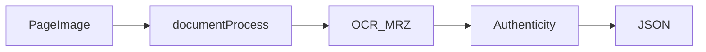

# Faceplugin ID Document Recognition Server SDK

ID Document Recognition as an HTTP API on **your** machine. Send page images; receive OCR, MRZ, barcode, image quality, and optional authenticity JSON.

Typical call order: `GET /api/machinecode` → send `FPMC1.…` → `POST /api/activate` → `POST /api/documentRecognition` / `documentLiveness` / `documentProcess`. Default port **8082**.

Parse results with [Document result JSON](document-result-json.md). Authenticity field names: [Document security check fields](document-security-check-fields.md).

Authenticity **without** OCR is a separate product: [ID Document Liveness SDK](../id-document-liveness-sdk/).

For on-device capture, use [Mobile SDK](mobile-sdk.md).

<table data-view="cards"><thead><tr><th></th><th></th><th></th><th data-hidden data-card-cover data-type="files"></th><th data-hidden data-card-target data-type="content-ref"></th></tr></thead><tbody><tr><td></td><td><strong>Linux SDK</strong></td><td>Docker image faceplugin/document-reader. Same HTTP API as Windows.</td><td><a href="../.gitbook/assets/linux-docker.png">linux-docker.png</a></td><td><a href="id-document-recognition-linux-sdk.md">id-document-recognition-linux-sdk.md</a></td></tr><tr><td></td><td><strong>Windows SDK</strong></td><td>HTTP API on port 8082. No Docker on Windows.</td><td><a href="../.gitbook/assets/windows.png">windows.png</a></td><td><a href="id-document-recognition-windows-sdk.md">id-document-recognition-windows-sdk.md</a></td></tr><tr><td></td><td><strong>Node SDK</strong></td><td>HTTP API on port 8082. Optional native libDocSDK.</td><td><a href="../.gitbook/assets/javascript.png">javascript.png</a></td><td><a href="id-document-recognition-node-sdk.md">id-document-recognition-node-sdk.md</a></td></tr></tbody></table>

### FAQ

**Is this a document verification API?** Yes. Port **8082**: `POST /api/documentRecognition`, `/api/documentLiveness`, `/api/documentProcess`.

**Passport OCR without authenticity?** Use `documentRecognition`. Authenticity-only is [ID Document Liveness](../id-document-liveness-sdk/) on port **8086**.

### Related documentation

* [Capabilities](capabilities.md) · [Faceplugin ID Document Recognition Mobile SDK](mobile-sdk.md) · [ID Document Recognition SDK](README.md)
* [ID Document Liveness Server SDK](../id-document-liveness-sdk/server-sdk.md)
* [Document result JSON](document-result-json.md)
* [Request a License](../request-a-license-and-support.md) · [Status codes](../resources/status-codes.md)
* [Combining products (eKYC)](../resources/choose-a-product.md) · [SDK comparison](../resources/comparisons/README.md)
