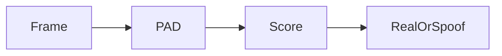

# Face Liveness Detection SDK

### Overview

**Faceplugin Face Liveness Detection SDK** is an on-premise **face anti-spoofing** / presentation-attack detection (PAD) engine. It answers: is a **live person** in front of the camera, or a printout, phone screen, 3D mask, or deepfake-style video?

**What it can do:** [Face Liveness Detection capabilities](capabilities.md) — passive PAD, mobile vs server, and when to use it versus Face Recognition Identify.

This product is **iBeta Level 2 class** **passive** PAD. The shipping Apps do not require a smile / turn-head challenge. That is **not** a separate “active liveness” SKU. Optional active prompts exist on some Face Recognition Identify flows, not on this App.

This SDK is **standalone**. It does **not** enroll people or run 1:N. If you already use Face Recognition Identify on mobile, that flow already includes **passive 2D liveness**. Choose this product when you need PAD **without** matching.

Capable of detecting:

* **Printed photos**
* **Screen replays**
* **3D models**
* **Deepfakes** (as an attack class inside PAD — not a separate deepfake product)

**Mobile** apps run a live camera (VideoWorker plus `faceDetection`). **Linux and Windows** expose a Face Liveness **API**: one RGB JPEG over `POST /api/liveness`. Score **0.5 or higher** is Real / pass.

### Platforms

Start with [Capabilities](capabilities.md), then **Mobile SDK** or **Server SDK**.

<table data-view="cards"><thead><tr><th></th><th></th><th></th><th data-hidden data-card-target data-type="content-ref"></th></tr></thead><tbody><tr><td></td><td><strong>Capabilities</strong></td><td>Passive PAD, API 8084, vs Identify 2D liveness.</td><td><a href="capabilities.md">capabilities.md</a></td></tr><tr><td></td><td><strong>Mobile SDK</strong></td><td>Android and iOS. Live camera PAD.</td><td><a href="mobile-sdk.md">mobile-sdk.md</a></td></tr><tr><td></td><td><strong>Server SDK</strong></td><td>Windows and Linux / Docker. JPEG over HTTP on port 8084.</td><td><a href="server-sdk.md">server-sdk.md</a></td></tr></tbody></table>

### FAQ

**What is passive liveness detection?** The engine scores a camera frame or JPEG without a user challenge animation. See [Capabilities](capabilities.md).

**What is the difference between this and Face Recognition liveness?** Face Recognition mobile Identify includes 2D liveness as part of matching. This product is PAD only.

**Does it require the internet?** No, after license activation.

### Usecases

* [x] Financial Services (Banking & Fintech)
* [x] Identity Verification & KYC (Know Your Customer)
* [x] Healthcare & Telemedicine
* [x] Access Control & Security
* [x] Online Education & Exam Proctoring
* [x] E-Commerce & Retail
* [x] Gaming & Entertainment
* [x] Fraud Prevention

### Related documentation

* [Capabilities](capabilities.md) · [Face Recognition SDK](../face-recognition-sdk/) · [ID Document Liveness SDK](../id-document-liveness-sdk/)
* [Request a License](../request-a-license-and-support.md) · [Try it](../resources/try-it.md) · [FAQ](../resources/faq.md)
* [Combining products (eKYC)](../resources/choose-a-product.md) · [SDK comparison](../resources/comparisons/README.md)
* [Status codes](../resources/status-codes.md)
