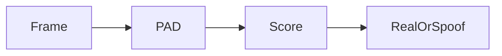

# Face Liveness Detection capabilities

What the Faceplugin **Face Liveness Detection SDK** can do — standalone face anti-spoofing / PAD — before you pick Android, iOS, or Linux.

For face matching, see [Face Recognition capabilities](../face-recognition-sdk/capabilities.md). For document authenticity (not face PAD), see [ID Document Liveness](../id-document-liveness-sdk/) or Document Recognition authenticity.



## Passive presentation-attack detection (PAD)

The shipping Apps are **iBeta Level 2 class** **passive** PAD: score a camera frame or JPEG **without** a smile / turn-head challenge. Optional active challenge demos on GitHub are **not** this product’s server API.

Capable of detecting attack classes including:

* Printed photos
* Screen replays
* 3D models / masks
* Deepfake-style video (as a PAD attack class — not a separate deepfake SKU)

Score **≥ 0.5** → Real / pass (server default operating point in these docs).

## Mobile vs server

| Surface | Behavior |
| --- | --- |
| **Android / iOS** | Live camera + VideoWorker / `faceDetection` for PAD |
| **Linux / Windows** | `POST /api/liveness` with one RGB JPEG on port **8084** |

There is **no** public Face Liveness Flutter or React Native App. Use native Liveness, or 2D liveness on Face Recognition Identify.

## When to use this vs Identify 2D liveness

| Need | Product |
| --- | --- |
| PAD **and** enroll / 1:N match | [Face Recognition](../face-recognition-sdk/capabilities.md) (Identify includes 2D liveness) |
| PAD **only** (no gallery) | **Face Liveness Detection** (this product) |
| Recognition + PAD in **one** server process | [Face Recognition + Liveness](../face-recognition-sdk/face-recognition-sdk-linux.md) on **8083** |
| Document authenticity (ID spoof) | Document Reader authenticity or [ID Document Liveness](../id-document-liveness-sdk/) **8086** |

## Face Liveness API

```bash
curl -s -X POST http://127.0.0.1:8084/api/liveness \
  -H 'Content-Type: application/json' \
  -d "{\"image\":\"$IMG\"}"
```

Images: `faceplugin/face-liveness`. See [Linux](liveness-detection-linux-sdk.md) · [Windows](liveness-detection-windows-sdk.md) · [Try it](../resources/try-it.md).

## Platforms

| Surface | Start here |
| --- | --- |
| Android, iOS | [Mobile SDK](mobile-sdk.md) |
| Linux Docker, Windows | [Server SDK](server-sdk.md) |

## Use cases

* Banking and fintech onboarding
* KYC / identity verification selfies
* Access control
* Exam proctoring and fraud prevention

## FAQ

**What is passive liveness detection?** Scoring a frame without a user challenge animation.

**Does it need the internet?** No, after license activation.

**Difference from Face Recognition liveness?** Identify embeds 2D liveness in matching; this SDK is PAD-only.

### Related documentation

* [Face Liveness Detection SDK](README.md) · [Face Recognition capabilities](../face-recognition-sdk/capabilities.md)
* [Try it](../resources/try-it.md) · [Request a License](../request-a-license-and-support.md)
* [SDK comparison](../resources/comparisons/README.md)
