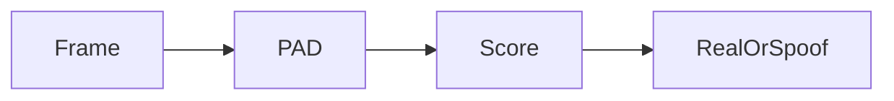

# Faceplugin Liveness Detection Mobile SDK

Standalone presentation-attack detection on Android and iOS. The demo scores whether the face is **real**. It does not enroll people or run 1:N search.

Live camera (VideoWorker plus `faceDetection`). Score **0.5 or higher** is treated as Real / pass.

If you already use Face Recognition Identify on mobile, that flow already includes **passive 2D liveness**. Choose this product when you need PAD **without** enrollment.

For JPEG-over-HTTP on Windows, Linux, and Docker, use [Server SDK](server-sdk.md).

<table data-view="cards"><thead><tr><th></th><th></th><th></th><th data-hidden data-card-cover data-type="files"></th><th data-hidden data-card-target data-type="content-ref"></th></tr></thead><tbody><tr><td></td><td><strong>Android SDK</strong></td><td>Native AAR. Liveness, Settings, and About screens.</td><td><a href="../.gitbook/assets/android.png">android.png</a></td><td><a href="liveness-detection-android-sdk.md">liveness-detection-android-sdk.md</a></td></tr><tr><td></td><td><strong>iOS SDK</strong></td><td>Three frameworks. Same PAD flow as Android.</td><td><a href="../.gitbook/assets/apple-logo-3-300x300.png">apple-logo-3-300x300.png</a></td><td><a href="liveness-detection-ios-sdk.md">liveness-detection-ios-sdk.md</a></td></tr></tbody></table>

### FAQ

**Is this active liveness?** No. The shipping Apps are **passive** PAD (no smile / turn-head challenge).

**Flutter / React Native?** There is no public Face Liveness Flutter or RN App. Use native Android/iOS, or 2D liveness on Face Recognition Identify.

### Related documentation

* [Faceplugin Liveness Detection Server SDK](server-sdk.md) · [Liveness Detection SDK](README.md)
* [Face Recognition Mobile SDK](../face-recognition-sdk/mobile-sdk.md)
* [Request a License](../request-a-license-and-support.md) · [Status codes](../resources/status-codes.md)
* [Combining products (eKYC)](../resources/choose-a-product.md) · [SDK comparison](../resources/comparisons/README.md)
