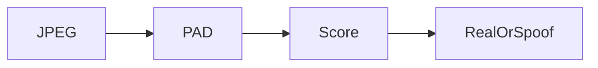

# Faceplugin Face Liveness Detection Server SDK

Score **one RGB JPEG** over HTTP. `POST /api/liveness` (alias `/api/check_liveness`). Score **0.5 or higher** → Real / pass.

Typical call order: `GET /api/machinecode` → send `FPMC1.…` → `POST /api/activate` → `POST /api/liveness`. Default port **8084**.

For a live camera on Android or iOS, use [Mobile SDK](mobile-sdk.md).

Need recognition **and** liveness? Run [Face Recognition Linux](../face-recognition-sdk/face-recognition-linux-sdk.md) on port **8083** and this product on port **8084**. Do not mix their `lib/cpu` runtimes.

<table data-view="cards"><thead><tr><th></th><th></th><th></th><th data-hidden data-card-cover data-type="files"></th><th data-hidden data-card-target data-type="content-ref"></th></tr></thead><tbody><tr><td></td><td><strong>Linux SDK</strong></td><td>Docker image faceplugin/face-liveness. Same HTTP API as Windows.</td><td><a href="../.gitbook/assets/linux-docker.png">linux-docker.png</a></td><td><a href="liveness-detection-linux-sdk.md">liveness-detection-linux-sdk.md</a></td></tr><tr><td></td><td><strong>Windows SDK</strong></td><td>HTTP API on port 8084. Send a JPEG, get a liveness score. No Docker.</td><td><a href="../.gitbook/assets/windows.png">windows.png</a></td><td><a href="liveness-detection-windows-sdk.md">liveness-detection-windows-sdk.md</a></td></tr></tbody></table>

### FAQ

**What is the Face Liveness API?** `POST /api/liveness` on port **8084**. Score **≥ 0.5** is Real / pass.

**Is this document anti-spoofing?** No. Use [ID Document Liveness](../id-document-liveness-sdk/).

### Related documentation

* [Capabilities](capabilities.md) · [Faceplugin Face Liveness Detection Mobile SDK](mobile-sdk.md) · [Face Liveness Detection SDK](README.md) · [Glossary](../resources/glossary.md)
* [Face Recognition Server SDK](../face-recognition-sdk/server-sdk.md)
* [ID Document Liveness Server SDK](../id-document-liveness-sdk/server-sdk.md)
* [Request a License](../request-a-license-and-support.md) · [Status codes](../resources/status-codes.md)
* [Combining products (eKYC)](../resources/choose-a-product.md) · [SDK comparison](../resources/comparisons/README.md)
