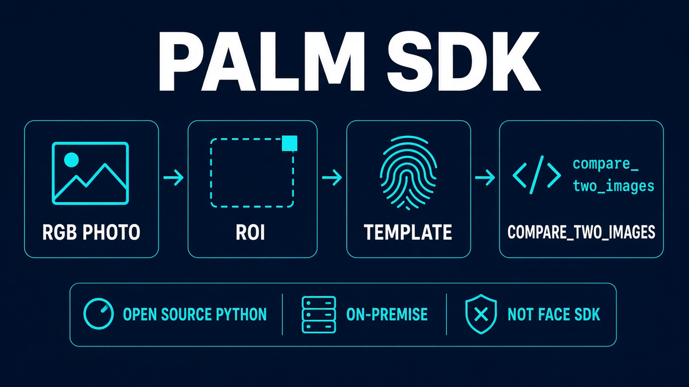

# Palm Recognition SDK

<figure><figcaption><p>Public Python sample. Not a Faceplugin Face Recognition App.</p></figcaption></figure>


### Code <a href="#setup" id="setup"></a>



### Overview <a href="#setup" id="setup"></a>

This page is the **open-source Palm Recognition** Python sample. It matches palms from a standard **RGB camera** on **your** machine. It is **not** the commercial [Face Recognition SDK](../face-recognition-sdk/), **not** Face Liveness, and **not** document OCR.

Unlike cloud palm APIs, processing stays local. No biometric data is sent to Faceplugin.

### Setup <a href="#setup" id="setup"></a>

Please download anaconda on your computer and install it. We used Windows machine without GPU for testing

1. Create anaconda environment

```
conda create -n palm python=3.9
```

2. Activate the environment

```
conda activate palm
```

3. Install dependencies

```
pip install torch torchvision torchaudio
pip install opencv-python
pip install tqdm
pip install scikit-image
pip install mediapipe
```

4. Compare two palm images in the `test_images` directory

```
python main.py
```

### APIs and Parameters

* **classify\_hand(mp\_hands, hand\_landmarks, image\_width):** determine if the hand is left hand or right hand
* **extract\_roi(hands, mp\_hands, img\_path):** extract region of interest from the palm image for template matching
* **extract\_features(mp\_hands, hands, path: str):** extract template from the plam image specified by the path parameter
* **compare\_two\_images(mp\_hands, hands, image\_path1, image\_path2, similarity\_threshold=0.8):** compare two hand images to determine if they are the same hand or not.

### FAQ

**Is this a Faceplugin commercial App?** No. It is a public GitHub sample. There is no `FP1.…` / Docker HTTP API on this page.

**Can I use it for face matching?** No. Use [Face Recognition](../face-recognition-sdk/).

### Related documentation

* [Palm Recognition SDK](README.md) · [Face Recognition SDK](../face-recognition-sdk/)
* [Request a License](../request-a-license-and-support.md) · [Choose a product](../resources/choose-a-product.md)
