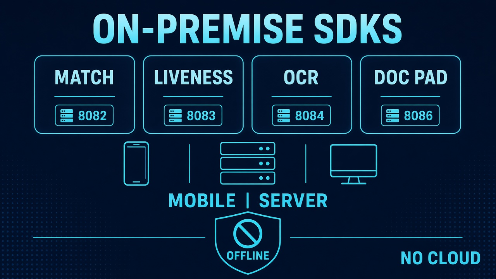

# Resources

<figure><figcaption>
Choose a product, Try it, FAQ, and comparisons for the public GitHub Apps.
</figcaption></figure>

Technical pages that apply across products: how to pick an SDK, copy-paste `curl`, status codes, FAQ, and vendor comparisons.

These pages do **not** replace the product → Mobile SDK / Server SDK tree. Start there for setup and real APIs (`setActivation`, `init`, `faceDetection`, `POST /api/liveness`, `documentProcess`).

* [Choose a product](choose-a-product.md) — catalog, ports, and eKYC combining
* [Try it](try-it.md) — health, machinecode, activate, detect, liveness, documentProcess
* [FAQ](faq.md)
* [Troubleshooting](troubleshooting.md)
* [Status codes](status-codes.md)
* [SDK comparison](comparisons/README.md)
* [Changelog](changelog.md)

### Related documentation

* [Welcome](../README.md) · [Request a License](../request-a-license-and-support.md)
