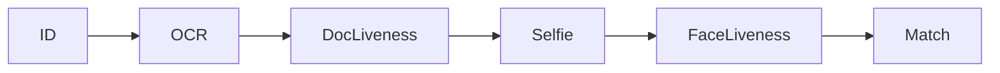

# Choose a product

Use this page as a catalog: **which GitHub repository to clone**, what the package or Docker image is called, and which HTTP port each server product listens on.

Always clone the **public** GitHub repository name shown in the tables below (for example `ID-Document-Recognition-Android`).

Need a vendor comparison? See [SDK comparison](comparisons/).

## Which product?

| You need                                      | Use                                                                                                                                                                                                                                                            |
| --------------------------------------------- | -------------------------------------------------------------------------------------------------------------------------------------------------------------------------------------------------------------------------------------------------------------- |
| Passport OCR / MRZ / ID card verification     | [Document capabilities](../id-document-recognition-sdk/capabilities.md) → [ID Document Recognition SDK](../id-document-recognition-sdk/)                                                                                                                       |
| Match faces 1:1 or 1:N / Face Recognition API | [Face Recognition capabilities](../face-recognition-sdk/capabilities.md) → [Face Recognition SDK](../face-recognition-sdk/)                                                                                                                                    |
| Face anti-spoofing only                       | [Face Liveness capabilities](../liveness-detection-sdk/capabilities.md) → [Face Liveness Detection SDK](../liveness-detection-sdk/)                                                                                                                            |
| Recognition and anti-spoofing together        | For recognition plus liveness on one server, use [Face Recognition + Liveness Linux](../face-recognition-sdk/face-recognition-sdk-linux.md) or [Windows](../face-recognition-sdk/face-recognition-sdk-windows.md) (port **8083**, includes `/api/liveness`). Or run separate services on **8083** and **8084**—never mix their runtime folders. |
| Document authenticity **without** OCR         | [ID Document Liveness SDK](../id-document-liveness-sdk/)                                                                                                                                                                                                       |

## ID Document Recognition

Scan passports, national IDs, and driver licenses on the device or over HTTP (**16,900** templates, **255** countries). Document authenticity (anti-spoofing of the ID itself) needs a license that includes that feature, unless you use the dedicated Document Liveness Linux product (authenticity only). Overview: [Document capabilities](../id-document-recognition-sdk/capabilities.md).

| Platform              | Clone                                                                                                                                                                                                                              | Package / image                | Port                        |
| --------------------- | ---------------------------------------------------------------------------------------------------------------------------------------------------------------------------------------------------------------------------------- | ------------------------------ | --------------------------- |
| Android               | [ID-Document-Recognition-Android](https://github.com/Faceplugin-ltd/ID-Document-Recognition-Android)                                                                                                                               | `documentreadersdk.aar`        | —                           |
| iOS                   | [ID-Document-Recognition-iOS](https://github.com/Faceplugin-ltd/ID-Document-Recognition-iOS)                                                                                                                                       | `docsdk.framework`             | —                           |
| Flutter               | [ID-Document-Recognition-Flutter](https://github.com/Faceplugin-ltd/ID-Document-Recognition-Flutter)                                                                                                                               | `document_reader_sdk`          | —                           |
| React Native          | [ID-Document-Recognition-React-Native](https://github.com/Faceplugin-ltd/ID-Document-Recognition-React-Native)                                                                                                                     | `document-reader-sdk`          | —                           |
| Ionic Capacitor       | [ID-Document-Recognition-Ionic-Capacitor](https://github.com/Faceplugin-ltd/ID-Document-Recognition-Ionic-Capacitor)                                                                                                               | `document-reader-capacitor`    | —                           |
| Ionic Cordova         | [ID-Document-Recognition-Ionic-Cordova](https://github.com/Faceplugin-ltd/ID-Document-Recognition-Ionic-Cordova)                                                                                                                   | Cordova plugin                 | —                           |
| Windows               | [ID-Document-Recognition-Windows](https://github.com/Faceplugin-ltd/ID-Document-Recognition-Windows)                                                                                                                               | `sdk.py` + `app.py`            | API **8082**, demo **9002** |
| Linux / Docker        | [ID-Document-Recognition-Docker](https://github.com/Faceplugin-ltd/ID-Document-Recognition-Docker)                                                                                                                                 | `faceplugin/document-reader`   | API **8082**, demo **9002** |
| Node.js HTTP          | [ID-Document-Recognition-Node](https://github.com/Faceplugin-ltd/ID-Document-Recognition-Node)                                                                                                                                     | HTTP API (optional native lib) | API **8082**                |
| Go / C++ HTTP         | [ID-Document-Recognition-Go](https://github.com/Faceplugin-ltd/ID-Document-Recognition-Go), […-CPP](https://github.com/Faceplugin-ltd/ID-Document-Recognition-CPP)                                                                 | HTTP API                       | API **8082**                |
| JavaScript client     | [ID-Document-Recognition-JavaScript](https://github.com/Faceplugin-ltd/ID-Document-Recognition-JavaScript)                                                                                                                         | Browser + Node client          | → **8082**                  |
| React / Vue / Angular | […-React](https://github.com/Faceplugin-ltd/ID-Document-Recognition-React), […-Vue](https://github.com/Faceplugin-ltd/ID-Document-Recognition-Vue), […-Angular](https://github.com/Faceplugin-ltd/ID-Document-Recognition-Angular) | Web demos (HTTP)               | → **8082**                  |

## Face Recognition

Detect faces, read attributes, extract templates, and match 1:1. Mobile demos also support live **1:N Identify** (VideoWorker) and a local person database. Server APIs currently expose still-image detect / quality / feature / match / similarity — not a gallery-based 1:N identification endpoint. Capability overview: [Face Recognition capabilities](../face-recognition-sdk/capabilities.md).

| Platform                                | Clone                                                                                                | Package / image                             | Port                                            |
| --------------------------------------- | ---------------------------------------------------------------------------------------------------- | ------------------------------------------- | ----------------------------------------------- |
| Android                                 | [FaceRecognition-Android](https://github.com/Faceplugin-ltd/FaceRecognition-Android)                 | `facerecognitionsdk.aar`                    | —                                               |
| iOS                                     | [FaceRecognition-iOS](https://github.com/Faceplugin-ltd/FaceRecognition-iOS)                         | `facerecognitionsdk` + engine + onnxruntime | —                                               |
| Flutter                                 | [FaceRecognition-Flutter](https://github.com/Faceplugin-ltd/FaceRecognition-Flutter)                 | `face_recognition_sdk`                      | —                                               |
| React Native                            | [FaceRecognition-React-Native](https://github.com/Faceplugin-ltd/FaceRecognition-React-Native)       | `face-recognition-sdk`                      | —                                               |
| Ionic Capacitor                         | [FaceRecognition-Ionic-Capacitor](https://github.com/Faceplugin-ltd/FaceRecognition-Ionic-Capacitor) | `face-recognition-capacitor`                | —                                               |
| Ionic Cordova                           | [FaceRecognition-Ionic-Cordova](https://github.com/Faceplugin-ltd/FaceRecognition-Ionic-Cordova)     | Cordova plugin                              | —                                               |
| Windows (recognition)                   | [FaceRecognition-Windows](https://github.com/Faceplugin-ltd/FaceRecognition-Windows)                 | `sdk.py` + `app.py`                         | API **8083**, demo **9003**                     |
| Linux / Docker (recognition)            | [FaceRecognition-Docker](https://github.com/Faceplugin-ltd/FaceRecognition-Docker)                   | `faceplugin/face-recognition`               | API **8083**, demo **9003**                     |
| Windows (recognition + liveness)        | [FaceRecognitionSDK-Windows](https://github.com/Faceplugin-ltd/FaceRecognitionSDK-Windows)           | `sdk.py` + `app.py`                         | API **8083** (+ `/api/liveness`), demo **9003** |
| Linux / Docker (recognition + liveness) | [FaceRecognitionSDK-Linux](https://github.com/Faceplugin-ltd/FaceRecognitionSDK-Linux)               | `faceplugin/face-recognition-liveness-sdk`  | API **8083** (+ `/api/liveness`), demo **9003** |

## Face Liveness

Standalone presentation-attack detection (anti-spoofing). Mobile uses a live camera plus VideoWorker. The server scores a single RGB JPEG. Capability overview: [Face Liveness capabilities](../liveness-detection-sdk/capabilities.md).

| Platform       | Clone                                                                                            | Package / image                         | Port                        |
| -------------- | ------------------------------------------------------------------------------------------------ | --------------------------------------- | --------------------------- |
| Android        | [FaceLivenessDetection-Android](https://github.com/Faceplugin-ltd/FaceLivenessDetection-Android) | `facelivenessdk.aar`                    | —                           |
| iOS            | [FaceLivenessDetection-iOS](https://github.com/Faceplugin-ltd/FaceLivenessDetection-iOS)         | `facelivenessdk` + engine + onnxruntime | —                           |
| Windows        | [FaceLivenessDetection-Windows](https://github.com/Faceplugin-ltd/FaceLivenessDetection-Windows) | `sdk.py` + `app.py`                     | API **8084**, demo **9004** |
| Linux / Docker | [FaceLivenessDetection-Docker](https://github.com/Faceplugin-ltd/FaceLivenessDetection-Docker)   | `faceplugin/face-liveness`              | API **8084**, demo **9004** |


Face Recognition mobile apps already include **2D liveness on Identify**. Use the standalone Face Liveness product when you need anti-spoofing without enrollment / 1:N.


## ID Document Liveness

Authenticity / anti-spoofing **only** (no OCR, MRZ, or barcode API). For OCR plus authenticity on one engine, use Document Reader with a Liveness-capable license.

| Platform       | Clone                                                                                                            | Image                          | Port                        |
| -------------- | ---------------------------------------------------------------------------------------------------------------- | ------------------------------ | --------------------------- |
| Linux / Docker | [ID-Document-Liveness-Detection-Docker](https://github.com/Faceplugin-ltd/ID-Document-Liveness-Detection-Docker) | `faceplugin/document-liveness` | API **8086**, demo **9006** |

## Combining products (eKYC) <a href="#combining-products-ekyc" id="combining-products-ekyc"></a>

**eKYC** means electronic know-your-customer / digital identity onboarding. A typical flow is:



Faceplugin does **not** offer one all-in-one identity-verification app. You combine Document Reader, Face Liveness, and Face Recognition in **your** mobile app or backend.

Keep each engine in its **own** process or container so OpenCV, ONNX, and model packs cannot overwrite each other.

Prefer **one process (or container) per product**. Do not dump two Google Drive runtimes into one `lib/cpu/` folder.

```
lib/
  dcr/cpu/    # Document Reader
  far/cpu/    # Face Recognition
  fal/cpu/    # Face Liveness
```

On Linux, run Docker containers on 8082 / 8083 / 8084 (and 8086 if you split document authenticity).


OpenCV, OpenSSL, and ONNX builds often differ between products. Do not copy two products’ runtime files into the same folder—shared libraries can overwrite each other and cause crashes or wrong scores.


| Product                             | Code  | Pack example |
| ----------------------------------- | ----- | ------------ |
| Face Recognition                    | `far` | `far.fpk`    |
| Face Liveness                       | `fal` | `fal.fpk`    |
| Document Reader / Document Liveness | `dcr` | `dcr.fpk`    |

Never ship a generic `models.fpk` next to another product.

On mobile: unique AAR / framework names, one license **per** application id **per** product, serialize native calls **per** engine. Face Liveness has no Flutter/React Native SDK—use Face Recognition’s 2D liveness and/or a native Face Liveness module.

### Related documentation

* [Try it](try-it.md) · [FAQ](faq.md) · [Troubleshooting](troubleshooting.md)
* [Request a License](../request-a-license-and-support.md)
